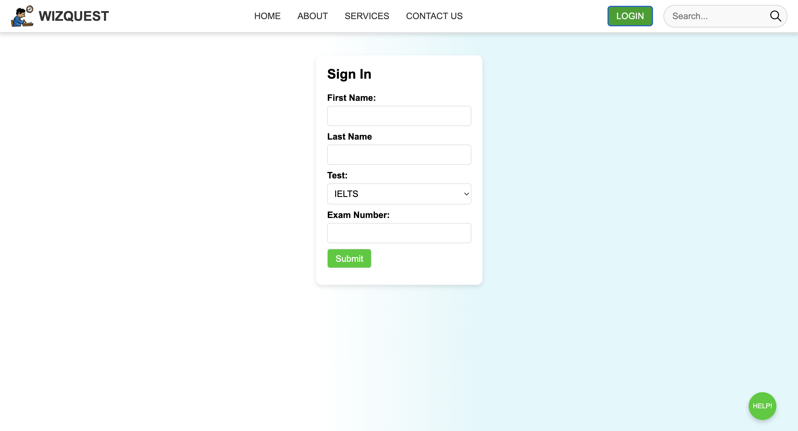
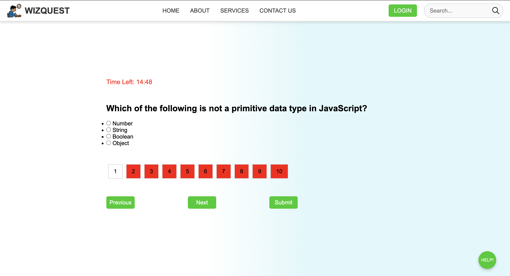

# 🧠 Quiz Application

This project is a simple quiz application that allows users to answer multiple-choice questions within set time and receive instant feedback on their performance. The app dynamically updates the UI based on user interactions and provides detailed explanations for each question.

# 🚀 Features
- Interactive timed multiple-choice quiz
- Real-time feedback on selected answers
- Explanation for correct answers
- Score tracking
- Responsive user interface

# 🖼️ Screenshots 




## Technologies Used
- HTML
- CSS
- JavaScript


## Usage
1. Select an answer for each question.
2. Click the "Submit" button to check your answer.
3. View instant feedback and explanation.
4. Continue to the next question until the quiz is complete.
5. Your score will be displayed at the end of the quiz.

## File Structure
```
quiz-app/
│-- index.html   # Main HTML file
│-- style.css    # Stylesheet for UI design
│-- script.js    # JavaScript logic for quiz functionality
```

## Contact
For any questions or feedback, feel free to reach out at (mailto:toyeadeleye@gmail.com).

